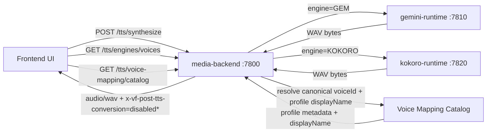
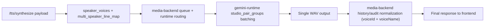
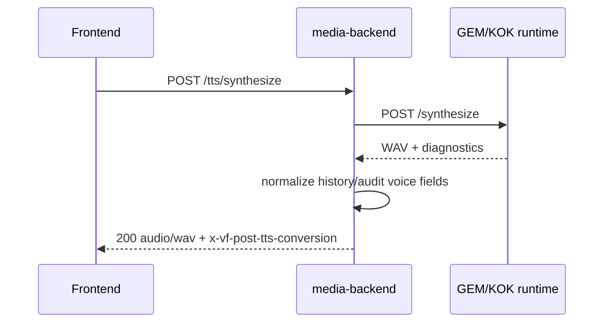

# TTS + Voice-Transfer Mapping + Multi-Speaker Processing Flow

This diagram documents the active production path with queue-based synthesis and canonical voice naming.

\* For Kokoro responses, `x-vf-post-tts-conversion=disabled_for_kokoro`.

## Multi-Speaker (GEM) Internal Flow

## Sequence: API Pathways

## Notes

- Frontend-facing endpoints:
  - `/tts/synthesize`
  - `/tts/engines/voices`
  - `/tts/voice-mapping/catalog`
- Voice-transfer profile mapping remains active for canonicalization and profile metadata.
- Post-TTS conversion branches are disabled in the active runtime flow.
- Shared mapping sources:
  - `backend/config/voice_profile_bank.v1.json`
  - `backend/config/voice_id_map.v1.json`
