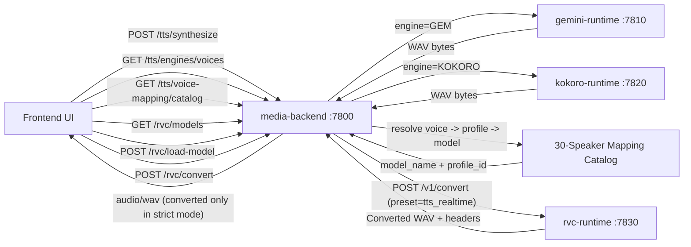
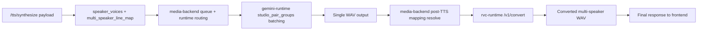
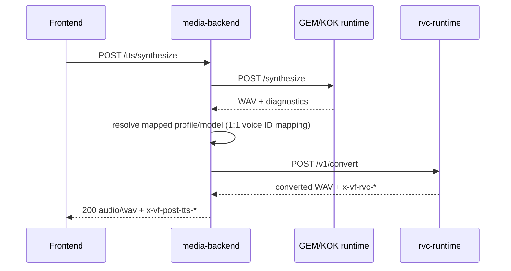

# TTS + RVC + Multi-Speaker Processing Flow

This diagram documents the current production pathway with isolated runtimes and stable frontend API contracts.

## Multi-Speaker (GEM) Internal Flow

## Sequence: API Pathways

## Notes

- Frontend-facing endpoints remain stable:
  - `/tts/synthesize`
  - `/rvc/models`
  - `/rvc/load-model`
  - `/rvc/convert`
- Internal RVC runtime API:
  - `GET /v1/health`
  - `GET /v1/models`
  - `POST /v1/load-model`
  - `POST /v1/convert`
- Shared mapping source:
  - `backend/config/voice_profile_bank.v1.json`
  - `backend/config/voice_id_map.v1.json`
