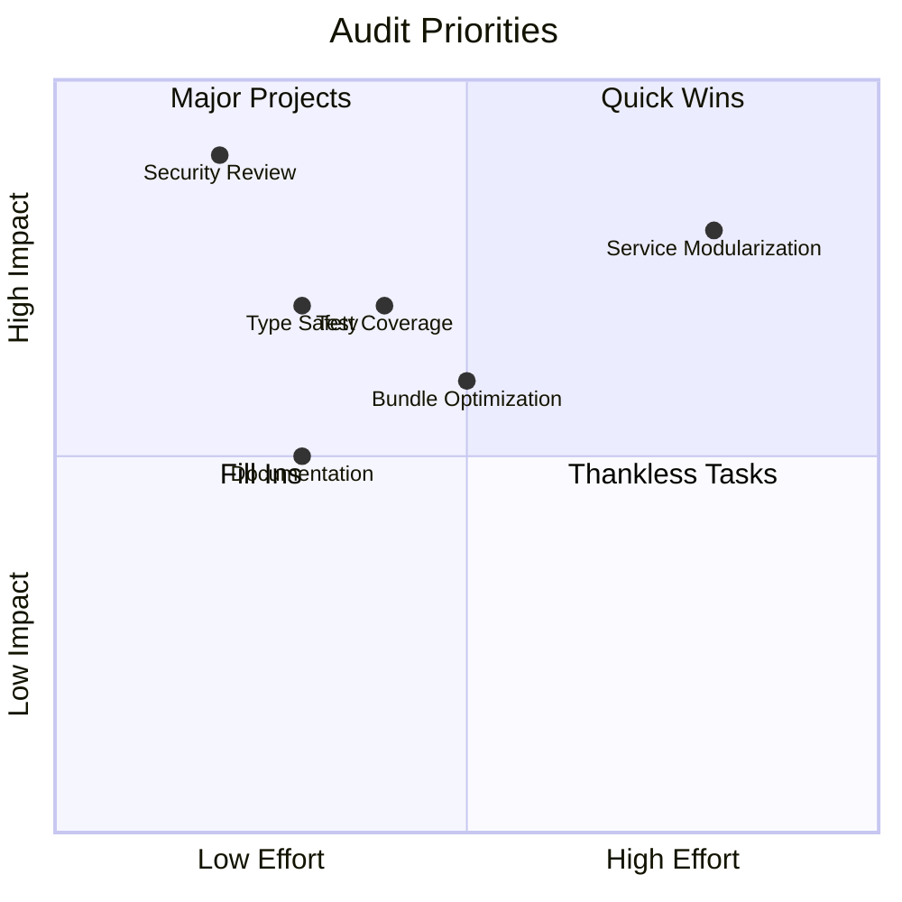

# Voice-Flow Full Project Audit Plan

**Audit Date:** 2026-04-13  
**Workspace:** `c:/Users/1wasi/OneDrive/Desktop/voice-Flow`  
**Scope:** Comprehensive frontend and infrastructure audit

---

## Executive Summary

Voice-Flow is a Next.js 16-based premium voice studio application with:
- **Frontend:** React 19, TypeScript, Tailwind CSS 4, Framer Motion
- **Backend Integration:** Firebase Auth, Firestore, Google Cloud TTS, Gemini AI
- **Deployment:** Cloudflare Workers (OpenNext), Cloud Run
- **Testing:** Vitest (unit), Playwright (E2E)

Based on initial analysis, the project demonstrates mature architecture with comprehensive documentation, extensive test coverage (100+ test files), and well-organized code structure.

---

## Project Structure Overview

```
voice-Flow/
├── frontend/                    # Main Next.js application
│   ├── app/                     # Next.js App Router
│   │   ├── (app)/              # Authenticated app routes
│   │   │   └── app/            # Main workspace (studio, library, reader, etc.)
│   │   ├── (public)/           # Public routes (landing, legal)
│   │   └── api/                # API routes (50+ endpoints)
│   ├── components/             # UI components (20+ components)
│   ├── views/                  # Page-level views (5 views)
│   ├── services/               # Business logic services
│   ├── contexts/               # React contexts (UserContext)
│   ├── src/shared/             # Shared utilities and helpers
│   └── tests/                  # Test files (100+ test files)
├── docs/                       # Documentation
│   └── audits/                 # Historical audit reports
├── infra/                      # Infrastructure configuration
│   └── cloudrun/               # Cloud Run deployment configs
└── .github/workflows/          # CI/CD pipelines
```

---

## Audit Categories

### 1. Security & Authentication

#### 1.1 Authentication Implementation
- [ ] Review Firebase Auth integration in [`UserContext.tsx`](frontend/contexts/UserContext.tsx:1)
- [ ] Verify token handling in [`authHttpClient.ts`](frontend/services/authHttpClient.ts)
- [ ] Check session management and token refresh logic
- [ ] Validate auth middleware in [`proxy.ts`](frontend/proxy.ts)

#### 1.2 Authorization & Access Control
- [ ] Review admin access controls in [`adminAccess.ts`](frontend/src/shared/auth/adminAccess.ts:1)
- [ ] Verify RBAC implementation for admin panel
- [ ] Check route protection in middleware
- [ ] Validate entitlements and plan restrictions

#### 1.3 Data Protection
- [ ] Review CSP headers in [`next.config.mjs`](frontend/next.config.mjs:7)
- [ ] Check storage key management in [`keys.ts`](frontend/src/shared/storage/keys.ts)
- [ ] Verify sensitive data handling (API keys, tokens)
- [ ] Review Firestore security rules

#### 1.4 API Security
- [ ] Review backend proxy policy in [`backendProxyPolicy.test.ts`](frontend/tests/backendProxyPolicy.test.ts:28)
- [ ] Check header forwarding and sanitization
- [ ] Verify CORS configuration
- [ ] Review rate limiting implementation

---

### 2. Code Quality & Architecture

#### 2.1 Service Layer Analysis
| Service | Lines | Purpose | Concerns |
|---------|-------|---------|----------|
| [`geminiService.ts`](frontend/services/geminiService.ts:1) | 3449 | TTS generation, Gemini integration | Large file, needs modularization |
| [`UserContext.tsx`](frontend/contexts/UserContext.tsx:1) | 1312 | Auth state management | Complex, consider splitting |
| [`studioMixService.ts`](frontend/services/studioMixService.ts:1) | 115 | Audio mixing | Well-contained |

#### 2.2 Type Safety
- [ ] Review [`types.ts`](frontend/types.ts:1) for completeness (644 lines)
- [ ] Check strict TypeScript config in [`tsconfig.json`](frontend/tsconfig.json:1)
- [ ] Verify `noUncheckedIndexedAccess` compliance
- [ ] Review type exports and imports

#### 2.3 Code Organization
- [ ] Verify feature-based architecture compliance
- [ ] Check [`src/shared/`](frontend/src/shared/) module organization
- [ ] Review component composition patterns
- [ ] Assess service/view separation

#### 2.4 ESLint Configuration
- [ ] Review rules in [`eslint.config.js`](frontend/eslint.config.js:1)
- [ ] Check React Hooks rules enforcement
- [ ] Verify console.log warnings (production)

---

### 3. Test Coverage & Quality

#### 3.1 Test File Analysis
**Total Test Files:** 100+ files in [`frontend/tests/`](frontend/tests/)

**Key Test Categories:**
| Category | Files | Coverage Focus |
|----------|-------|----------------|
| Admin | 12 | Admin panel, RBAC, provisioning |
| Billing | 6 | Checkout, coupons, entitlements |
| Voice Clone | 8 | Cloning, stress testing, status |
| TTS/Runtime | 10 | Engine routing, long text, gateway |
| Auth | 4 | Token handling, verification |
| UI Components | 8 | Layout, navigation, tabs |

#### 3.2 Test Quality Checks
- [ ] Verify test isolation and cleanup
- [ ] Check mock patterns and test utilities
- [ ] Review E2E test stability in [`tests/smoke/`](frontend/tests/smoke/)
- [ ] Assess edge case coverage

#### 3.3 Critical Test Files to Review
- [`geminiServicePublicEngineRouting.test.ts`](frontend/tests/geminiServicePublicEngineRouting.test.ts:59) - Engine routing logic
- [`authHttpClient.test.ts`](frontend/tests/authHttpClient.test.ts:14) - Auth request handling
- [`backendProxyPolicy.test.ts`](frontend/tests/backendProxyPolicy.test.ts:28) - Proxy security

---

### 4. Performance & Bundle

#### 4.1 Bundle Configuration
- [ ] Review bundle budget in [`bundle-budget.json`](frontend/artifacts/bundle-budget.json)
- [ ] Check tree-shaking effectiveness
- [ ] Analyze chunk splitting strategy
- [ ] Review dynamic imports usage

#### 4.2 Scripts Analysis
Key scripts from [`package.json`](frontend/package.json:6):
```json
{
  "build": "next build --turbopack && node scripts/prune-bundled-audio.mjs",
  "audit:prod": "npm run typecheck && npm run lint && npm run maintainability:check && npm run test:ci && npm run build",
  "bundle:report": "node scripts/bundle-report.mjs",
  "perf:lighthouse": "node scripts/perf-lighthouse.mjs"
}
```

#### 4.3 Performance Checks
- [ ] Review audio asset optimization
- [ ] Check image optimization settings
- [ ] Analyze font loading strategy
- [ ] Review animation performance (Framer Motion)

---

### 5. API Routes & Backend Integration

#### 5.1 API Route Inventory
**Total Routes:** 50+ endpoints in [`frontend/app/api/`](frontend/app/api/)

**Key Route Categories:**
| Category | Routes | Purpose |
|----------|--------|---------|
| Auth | `/api/auth/session`, `/api/dev/session` | Session management |
| Backend Proxy | `/api/backend/[...path]` | Backend API proxy |
| Billing | `/api/v1/billing/*` | Stripe integration |
| TTS | `/api/v1/tts/*`, `/api/v1/studio/tts/*` | Text-to-speech |
| Voice Clone | `/api/v1/voice-clone/*` | Voice cloning |
| Admin | `/api/v1/admin/*` | Admin operations |

#### 5.2 Route Security Review
- [ ] Check authentication middleware on protected routes
- [ ] Verify input validation patterns
- [ ] Review error handling consistency
- [ ] Check rate limiting on sensitive endpoints

---

### 6. Infrastructure & Deployment

#### 6.1 Cloud Run Configuration
- [ ] Review [`deploy.ps1`](infra/cloudrun/deploy.ps1:1) deployment script
- [ ] Check service configuration in `services.default.json`
- [ ] Verify environment variable handling
- [ ] Review VPC connector configuration

#### 6.2 Cloudflare Workers
- [ ] Review [`wrangler.jsonc`](frontend/wrangler.jsonc)
- [ ] Check [`open-next.config.ts`](frontend/open-next.config.ts)
- [ ] Verify edge runtime compatibility

#### 6.3 CI/CD Pipeline
- [ ] Review [`infra-policy.yml`](.github/workflows/infra-policy.yml:1) workflow
- [ ] Check deployment gates and validations
- [ ] Verify secret management

---

### 7. Error Handling & Logging

#### 7.1 Error Handling Patterns
- [ ] Review error utilities in [`formatFrontendError.ts`](frontend/src/shared/errors/formatFrontendError.ts)
- [ ] Check runtime error handling in [`runtimeSwitchErrors.ts`](frontend/src/shared/runtime/runtimeSwitchErrors.ts:8)
- [ ] Verify API error responses consistency

#### 7.2 Telemetry
- [ ] Review frontend error telemetry in [`frontendErrors.ts`](frontend/src/shared/telemetry/frontendErrors.ts)
- [ ] Check diagnostic events (TTS_RUNTIME_DIAGNOSTICS_EVENT)
- [ ] Verify error reporting to backend

---

### 8. Documentation Assessment

#### 8.1 Existing Documentation
| Document | Purpose | Status |
|----------|---------|--------|
| [`FRONTEND_ARCHITECTURE.md`](docs/FRONTEND_ARCHITECTURE.md:1) | Architecture overview | Current |
| [`RELIABILITY_RUNBOOK.md`](docs/RELIABILITY_RUNBOOK.md:1) | Operations runbook | Current |
| [`FRONTEND_PRODUCTION_CHECKLIST.md`](docs/FRONTEND_PRODUCTION_CHECKLIST.md) | Production readiness | Needs review |
| [`SCALING_ARCHITECTURE.md`](docs/SCALING_ARCHITECTURE.md) | Scaling strategy | Needs review |

#### 8.2 Documentation Gaps
- [ ] API documentation completeness
- [ ] Component usage examples
- [ ] Deployment runbook updates
- [ ] Contributing guidelines

---

### 9. Technical Debt Assessment

#### 9.1 Known Issues from Previous Audits
Based on [`deep-audit-2026-03-09.md`](docs/audits/deep-audit-2026-03-09.md:1):
- ✅ Pytest config mutation guard (resolved)
- ✅ Queue/reliability test network leakage (resolved)
- ✅ Guardian test mutation path isolation (resolved)

#### 9.2 Potential Technical Debt
| Area | Concern | Priority |
|------|---------|----------|
| [`geminiService.ts`](frontend/services/geminiService.ts:1) | 3449 lines - needs modularization | High |
| Legacy engine tokens | Backward compatibility mapping needed | Medium |
| Storage migration | LocalStorage to IndexedDB migration | Medium |
| Test flakiness | E2E test stability | Medium |

---

### 10. Recommendations Priority Matrix



---

## Audit Execution Plan

### Phase 1: Security Deep Dive
1. Authentication flow analysis
2. Authorization boundary testing
3. API security review
4. Data protection audit

### Phase 2: Code Quality Assessment
1. Service layer review
2. Component architecture analysis
3. Type safety verification
4. Technical debt inventory

### Phase 3: Testing & Performance
1. Test coverage analysis
2. Bundle size review
3. Performance benchmarking
4. E2E test stability

### Phase 4: Infrastructure & Documentation
1. Deployment configuration review
2. CI/CD pipeline audit
3. Documentation completeness
4. Final recommendations

---

## Success Criteria

- [ ] All security vulnerabilities identified and documented
- [ ] Code quality issues prioritized by severity
- [ ] Performance bottlenecks identified
- [ ] Technical debt catalogued with remediation plans
- [ ] Documentation gaps identified
- [ ] Actionable recommendations provided

---

## Appendix A: Key Files Reference

| Category | File | Purpose |
|----------|------|---------|
| Core Service | [`geminiService.ts`](frontend/services/geminiService.ts:1) | TTS generation |
| Auth Context | [`UserContext.tsx`](frontend/contexts/UserContext.tsx:1) | User state |
| Types | [`types.ts`](frontend/types.ts:1) | Type definitions |
| Constants | [`constants.ts`](frontend/constants.ts:1) | App constants |
| Config | [`next.config.mjs`](frontend/next.config.mjs:1) | Next.js config |
| Middleware | [`middleware.ts`](frontend/middleware.ts:1) | Request handling |
| Deploy | [`deploy.ps1`](infra/cloudrun/deploy.ps1:1) | Cloud Run deploy |

---

## Appendix B: Test Statistics

- **Total Test Files:** 100+
- **Test Categories:** 15+
- **E2E Specs:** 20+ in [`tests/smoke/`](frontend/tests/smoke/)
- **Coverage Areas:** Admin, Billing, TTS, Voice Clone, Auth, UI

---

*This audit plan is ready for review and approval before proceeding with detailed implementation.*
